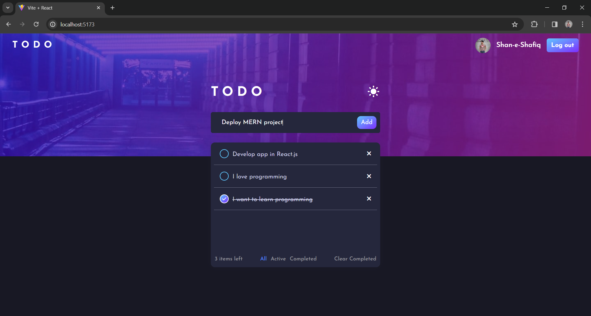
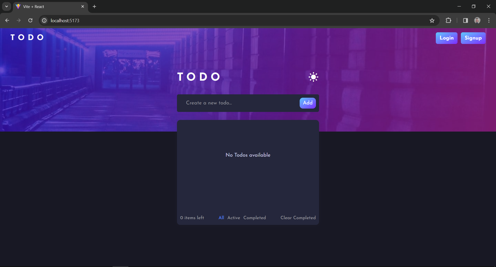
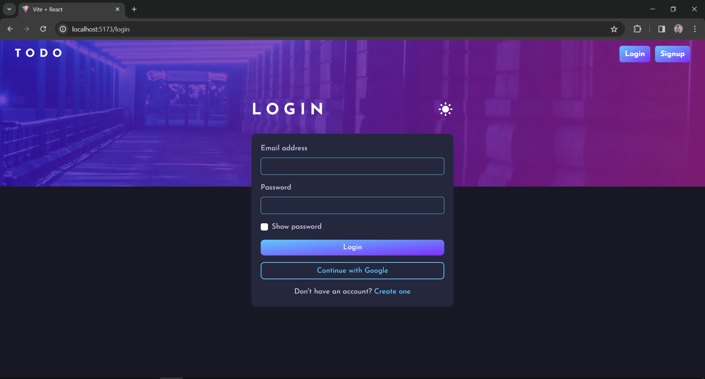
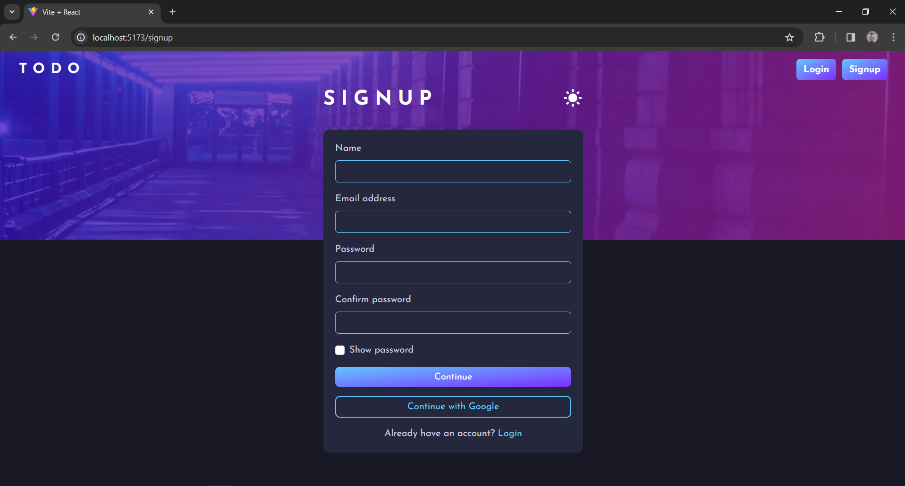
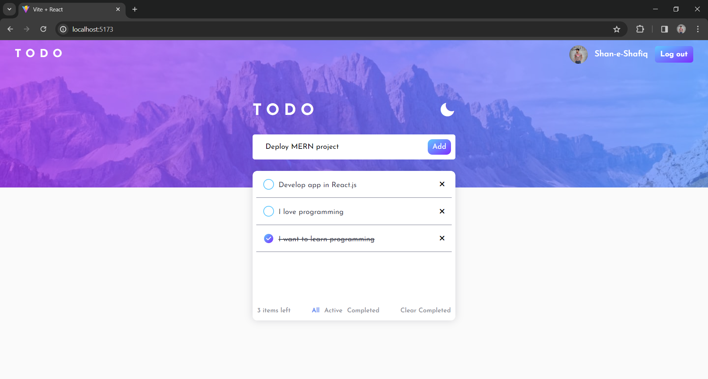

# TODO App in React.js with Firebase Authentication 📝

**Your Productive Todo Manager**

**Software Type:** Web Application

This TODO app is developed using React.js, Firebase for authentication, and Bootstrap for styling, providing a seamless user experience to manage your tasks efficiently.

**Key Features** ✨:

* **User Authentication**: Sign up and log in securely with email and password or authenticate with Google account for ease of access.
* **Task Management**: Add, mark as completed or uncompleted, and delete tasks effortlessly to stay organized.
* **Filtering Options**: Filter tasks by All todos, Active todos (not completed yet), and Completed todos to focus on what matters.
* **Bulk Actions**: Clear all completed todos at once with the 'Clear completed' option for a clutter-free workspace.

**Technologies** ⚙️:

> React.js
> Firebase (Authentication)
> Firebase (Cloud FireStore)
> Bootstrap
> Custom CSS

**Deployment** :

* **Frontend:** Hosted on [Vercel](https://vercel.com), ensuring reliable deployment and scalability.

**Website Link** :

* Live at : [TODO App](https://todo-app-ashen-sigma.vercel.app/)

**ScreenShots**

